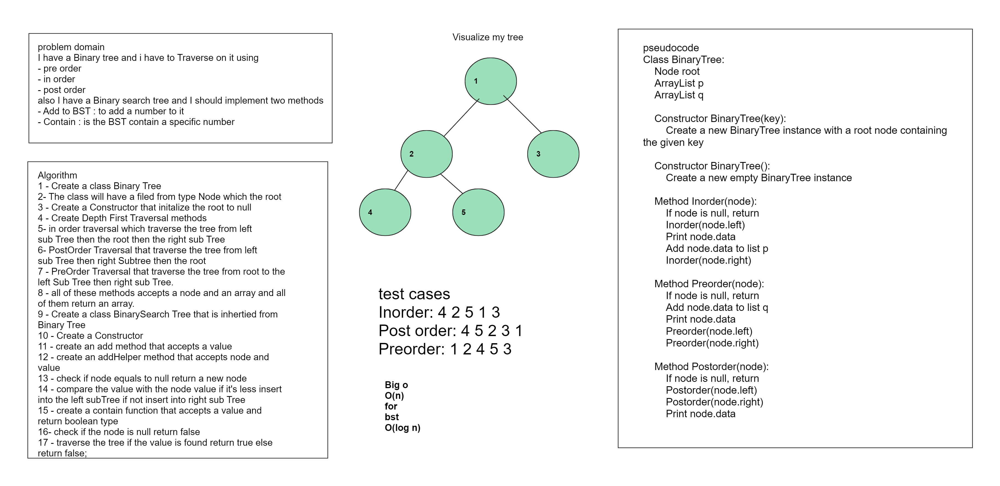
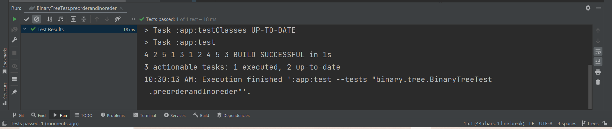

# Trees
<!-- Description of the challenge -->
##### I have a Binary tree and i have to Traverse on it using 
- pre order
- in order
- post order
##### I have a Binary search tree and I should implement two methods
- Add to BST : to add a number to it
- Contain : is the BST contain a specific number
## Whiteboard Process
<!-- Embedded whiteboard image -->

## Approach & Efficiency
for Binary tree
Time BigO :  o(n)
Meomry BigO : o(n)
for BST
- Add method
Time BigO :  o(log n)
Meomry BigO : o(n)
- Contain method
Time BigO :  o(log n)

<!-- What approach did you take? Why? What is the Big O space/time for this approach? -->

## Solution
<!-- Show how to run your code, and examples of it in action -->

