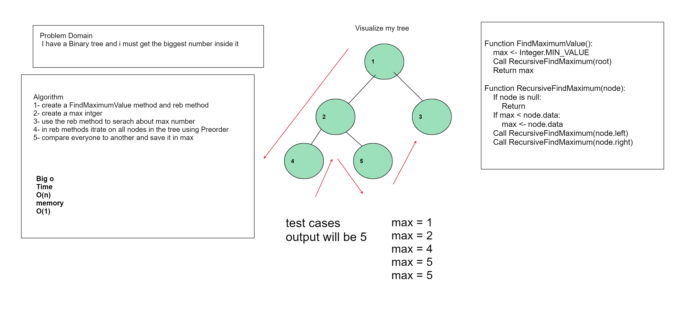
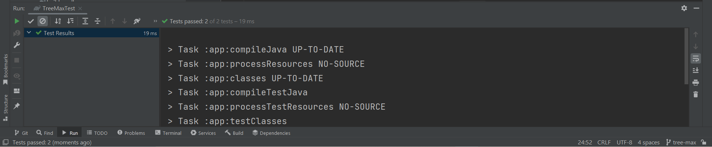

# Trees
<!-- Description of the challenge -->
#####  I have a Binary tree and i must get the biggest number inside it

## Whiteboard Process

<!-- Embedded whiteboard image -->

## Approach & Efficiency
Big O
Time BigO :  o(n)
Meomry BigO : o(1)

<!-- What approach did you take? Why? What is the Big O space/time for this approach? -->

## Solution
<!-- Show how to run your code, and examples of it in action -->

