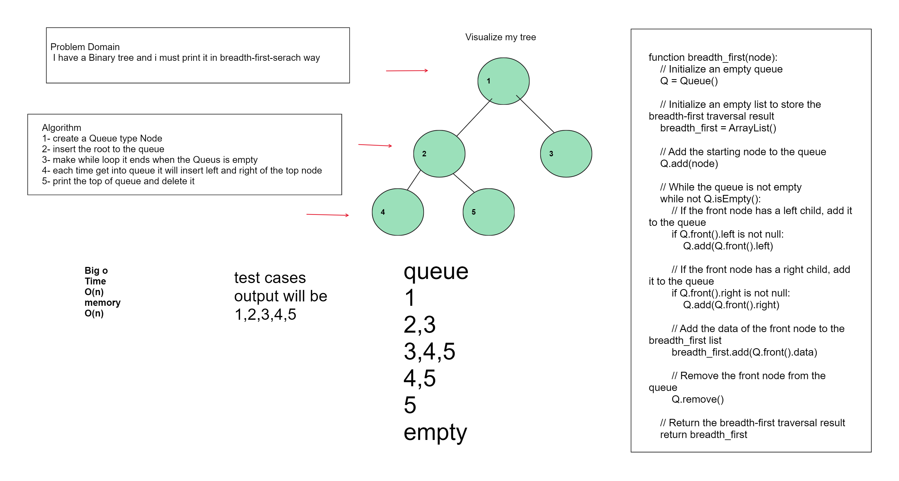

# Trees
<!-- Description of the challenge -->
#####  Problem Domain : I have a Binary tree and i must print it in breadth-first-serach way

## Whiteboard Process

<!-- Embedded whiteboard image -->

## Approach & Efficiency
Big O
Time BigO :  o(n)
Meomry BigO : o(n)

<!-- What approach did you take? Why? What is the Big O space/time for this approach? -->

## Solution
<!-- Show how to run your code, and examples of it in action -->

