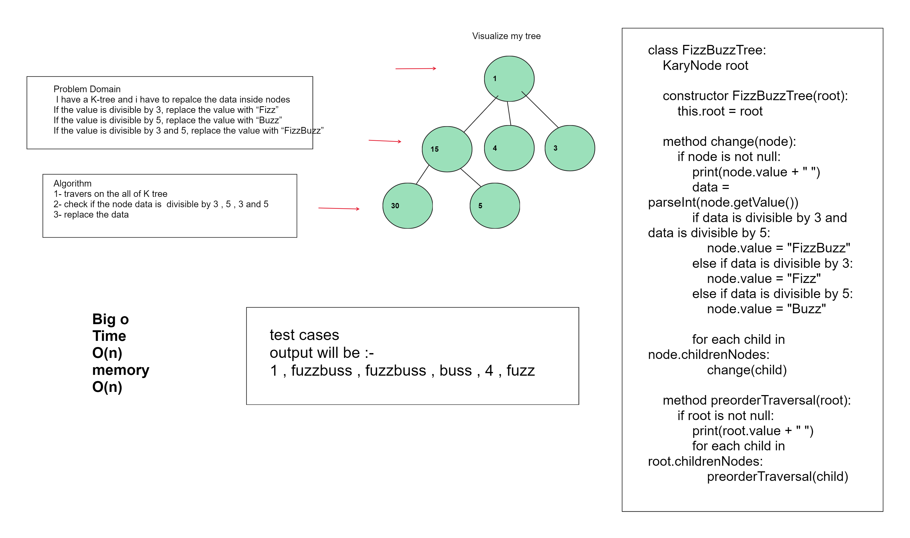
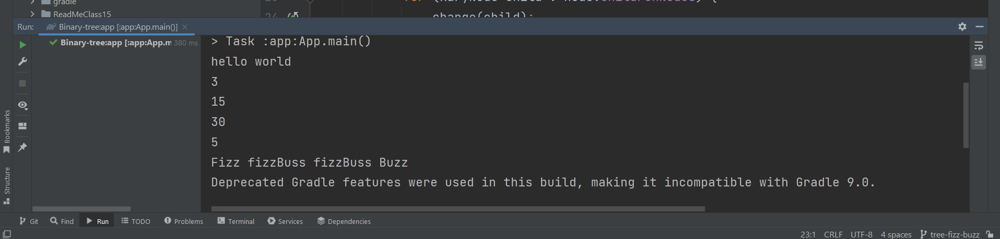

# Trees
<!-- Description of the challenge -->
#####  Problem Domain : 
I have a K-tree and i have to replace the data inside nodes
If the value is divisible by 3, replace the value with “Fizz”
If the value is divisible by 5, replace the value with “Buzz”
If the value is divisible by 3 and 5, replace the value with “FizzBuzz”

## Whiteboard Process

<!-- Embedded whiteboard image -->

## Approach & Efficiency
Big O
Time BigO :  o(n)
Meomry BigO : o(n)

<!-- What approach did you take? Why? What is the Big O space/time for this approach? -->

## Solution
<!-- Show how to run your code, and examples of it in action -->

