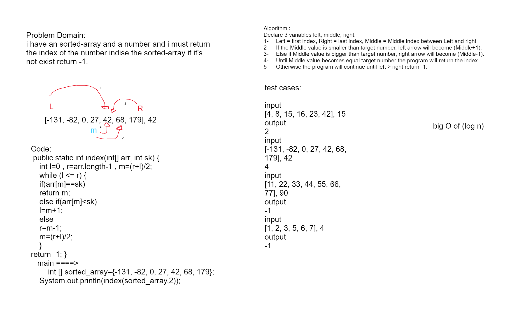
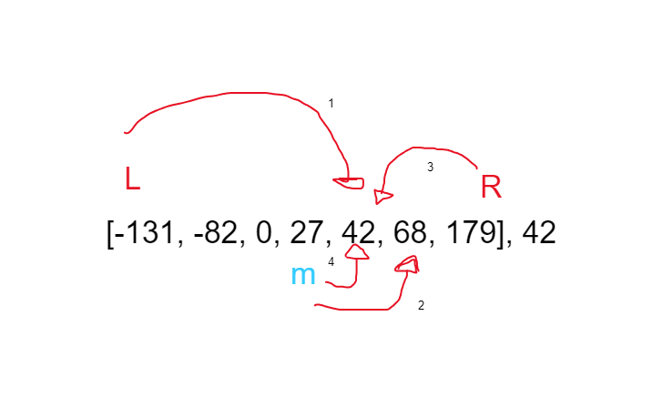

# whiteBoard
## the picture
.png)

### Approach & Efficiency
Problem Domain:
i have an sorted-array and a number and i must return the index of the number indise the sorted-array if it's not exist return -1.

### visual:
[4, 8, 15, 16, 23, 42], 15	==> 2

### Algorithm:
Algorithm :
Declare 3 variables left, middle, right.
1-	Left = first index, Right = last index, Middle = Middle index between Left and right
2-	If the Middle value is smaller than target number, left arrow will become (Middle+1).
3-	Else if Middle value is bigger than target number, right arrow will become (Middle-1).
4-	Until Middle value becomes equal target number the program will return the index 
5-	Otherwise the program will continue until left > right return -1. 
 

## Big O:
O(log n)

## Code:
<pre>
 public static int index(int[] arr, int sk) {
    int l=0 , r=arr.length-1 , m=(r+l)/2;
    while (l <= r) {
    if(arr[m]==sk)
    return m;
    else if(arr[m]<sk)
    l=m+1;
    else
    r=m-1;
    m=(r+l)/2;
    }
return -1;
    }
    public static void main(String[] args) {
        int [] sorted_array={-131, -82, 0, 27, 42, 68, 179};
    System.out.println(index(sorted_array,2));
    }

</pre>

## test cases:

<pre>
input 
[4, 8, 15, 16, 23, 42], 15	
output
2
input
[-131, -82, 0, 27, 42, 68, 179], 42
4
input 
[11, 22, 33, 44, 55, 66, 77], 90
output
-1
input 
[1, 2, 3, 5, 6, 7], 4
output
-1
</pre>
