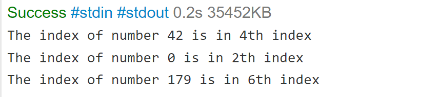

# Challenge Title
<!-- Description of the challenge -->
### Binary Search
### Problem Domain:
i have an sorted-array and a number and i must return the index of the number indise the sorted-array if it's not exist return -1.

## Whiteboard Process
<!-- Embedded whiteboard image -->

## Approach & Efficiency
<!-- What approach did you take? Why? What is the Big O space/time for this approach? -->
#### Algorithm:
Algorithm :
Declare 3 variables left, middle, right.
1-	Left = first index, Right = last index, Middle = Middle index between Left and right
2-	If the Middle value is smaller than target number, left arrow will become (Middle+1).
3-	Else if Middle value is bigger than target number, right arrow will become (Middle-1).
4-	Until Middle value becomes equal target number the program will return the index 
5-	Otherwise the program will continue until left > right return -1. 
#### Big O:
Time O(log n)
Memory O(n)

## Solution
<!-- Show how to run your code, and examples of it in action -->

## Code:
<pre>
 public static int index(int[] arr, int sk) {
    int l=0 , r=arr.length-1 , m=(r+l)/2;
    while (l <= r) {
    if(arr[m]==sk)
    return m;
    else if(arr[m]<sk)
    <pre>l=m+1;
    else
    r=m-1;
    m=(r+l)/2;
    }
return -1;
    }
    Main =======>>
        int [] sorted_array={-131, -82, 0, 27, 42, 68, 179};
    System.out.println("The index of number 42 is in" + index(sorted_array,42)); </pre>
 
    
</pre>
