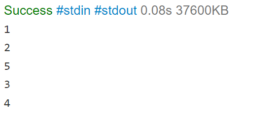

# Challenge Title
<!-- Description of the challenge -->
### array-insert-shift
Problem Domain:
I have an array with a number ,and i should return a new array with the given number and put it in the middle of it.
## Whiteboard Process
<!-- Embedded whiteboard image -->
.png)
## Approach & Efficiency
<!-- What approach did you take? Why? What is the Big O space/time for this approach? -->
### Algorithm:
In order to put the number in the midlle of array.
- get the index middle
- make a new array with lenght+1
- itrate through the first array and put all values in second one 

### Big O:
time O(n)
memory O(n)

## Solution
<!-- Show how to run your code, and examples of it in action -->

## Code:
<pre>
 static int[]insertShiftArray(int [] arr,int n){
    int[] numbers = new int[(arr.length)+1];
    if(arr.length==0){
        System.out.println("error");
        return new int[0];
    }
    if(arr.length==1){
    numbers[0]=arr[0]; numbers[1]=n;
    return numbers;}
    float m = (float)arr.length/2;
    double roundedUp = Math.ceil(m);
    int e=0;
    for (int i=0;i<(arr.length);++i){
        if(i==(roundedUp)){;
        continue;}
        numbers[i]=arr[e];
        ++e;
    }
    numbers[(int)roundedUp]=n;
    numbers[numbers.length-1]=arr[arr.length-1];
  
    return numbers;  
} 

main ==============>

  int [] y = {1,2,3,4};
   int [] r = insertShiftArray(y,5);
 for (int i=0;i<(r.length);++i){
  System.out.println(r[i]);
}
</pre>

