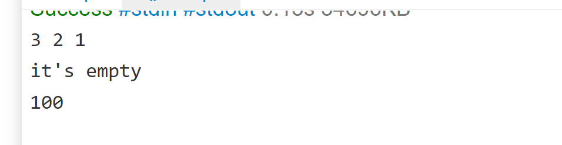

# Challenge Title
<!-- Description of the challenge -->
Problem Domain:
Reversing the elements of an array.
## Whiteboard Process
<!-- Embedded whiteboard image -->
### the picture
.png)
## Approach & Efficiency
<!-- What approach did you take? Why? What is the Big O space/time for this approach? -->
### Algorithm:
In order to reverse the elements of the array we need to make a backward loop from the last index to the first one and assaign the last index to another array to be the first index of it and so on until the first index of the original array becomes the last index of the revered array
### Big O:  
Memory O(n)
Time O(n)
## Solution
<!-- Show how to run your code, and examples of it in action -->

Code:
<pre>public class ArrayReverse 

{		public	static int [] reverseArray (int[]arr){
		int[] myArray = new int[arr.length]; 
		if(arr.length==0){
		System.out.println("it's empty");
		return myArray;
		}
		int e=0;
		for (int i=arr.length-1;i>=0;--i){
		myArray[e]=arr[i];
		System.out.print(myArray[e]+" ");
		++e;}
		System.out.println();
		return myArray;
		}
	public static void main (String[] args) throws java.lang.Exception
	{
reverseArray(new int[]{1, 2, 3});
reverseArray(new int[]{});
reverseArray(new int[]{100});

  
}}</pre>

