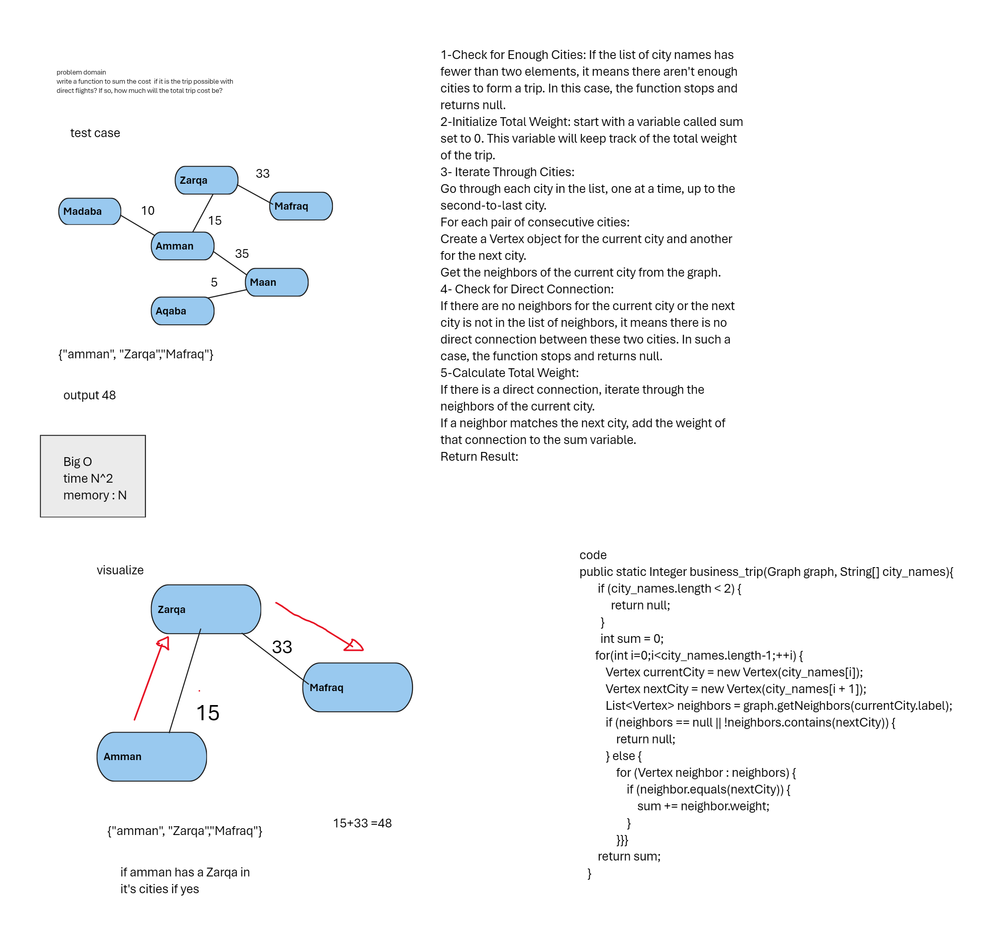

# **Note the function itself in the main App for Cc37**

## Challenge Title
graph-business-trip

## Whiteboard Process
<!-- Embedded whiteboard image -->

## Approach & Efficiency
<!-- What approach did you take? Why? What is the Big O space/time for this approach? -->
Big O 
time : O(n^2)
Memory : O(n)
## Solution
`Lab37`