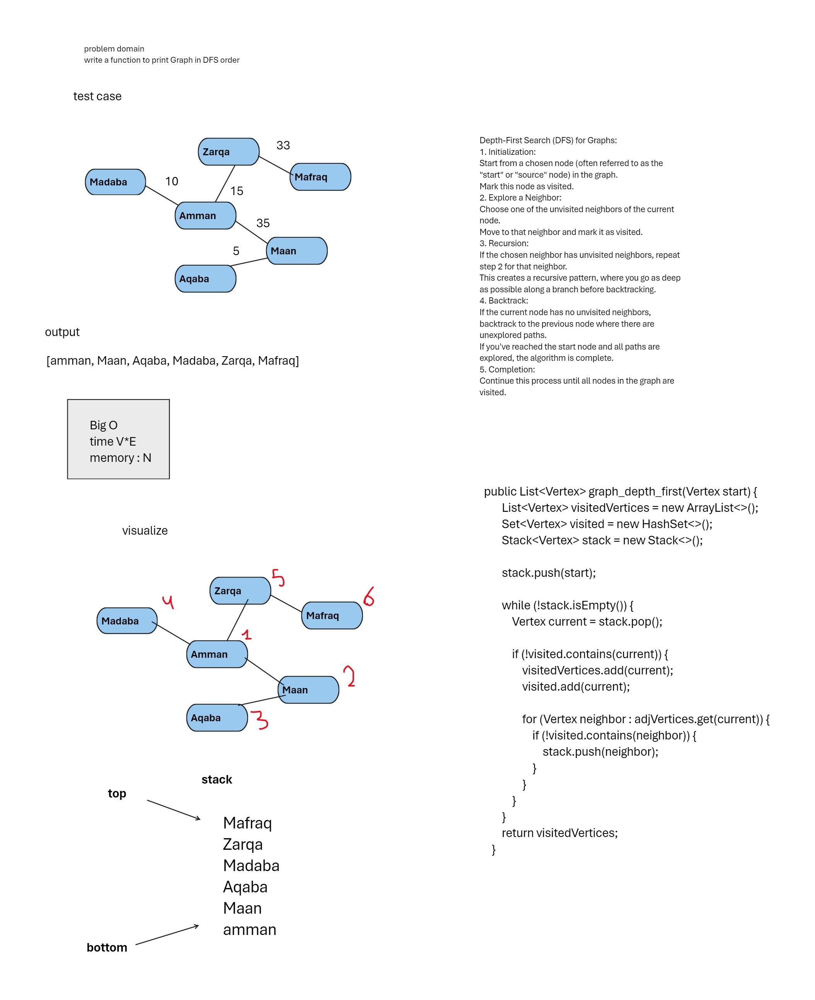

## Challenge Title
graph-depth-first

## Whiteboard Process
<!-- Embedded whiteboard image -->

## Approach & Efficiency
<!-- What approach did you take? Why? What is the Big O space/time for this approach? -->
Big O  
time : O(V^E)   
Memory : O(n  )      
## Solution
`Cc38`