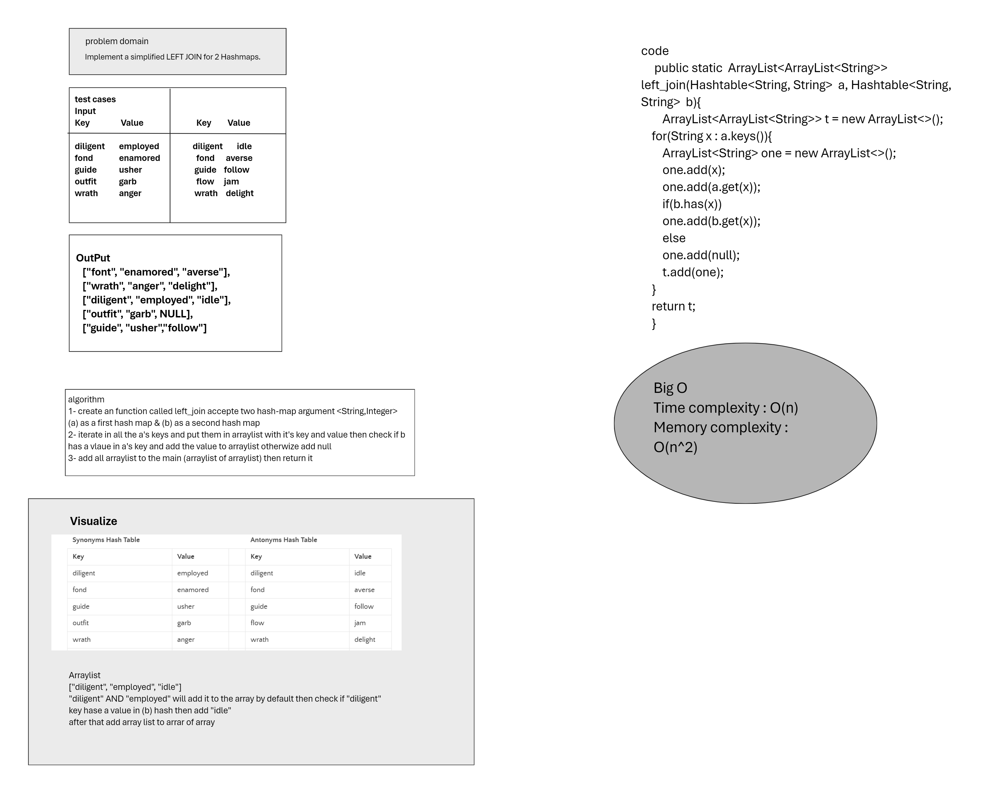

# LEFT JOIN
Implement a simplified LEFT JOIN for 2 Hashmaps.

## Whiteboard Process
<!-- Embedded whiteboard image -->

## Approach & Efficiency
Time complexity : O(n)  
Memory complexity : O(n^2)

## Solution
<!-- Show how to run your code, and examples of it in action -->
I put the code in the (Main class)
and I have put a test case in (LiftJoinLab33.java)
`LiftJoinLab33`

