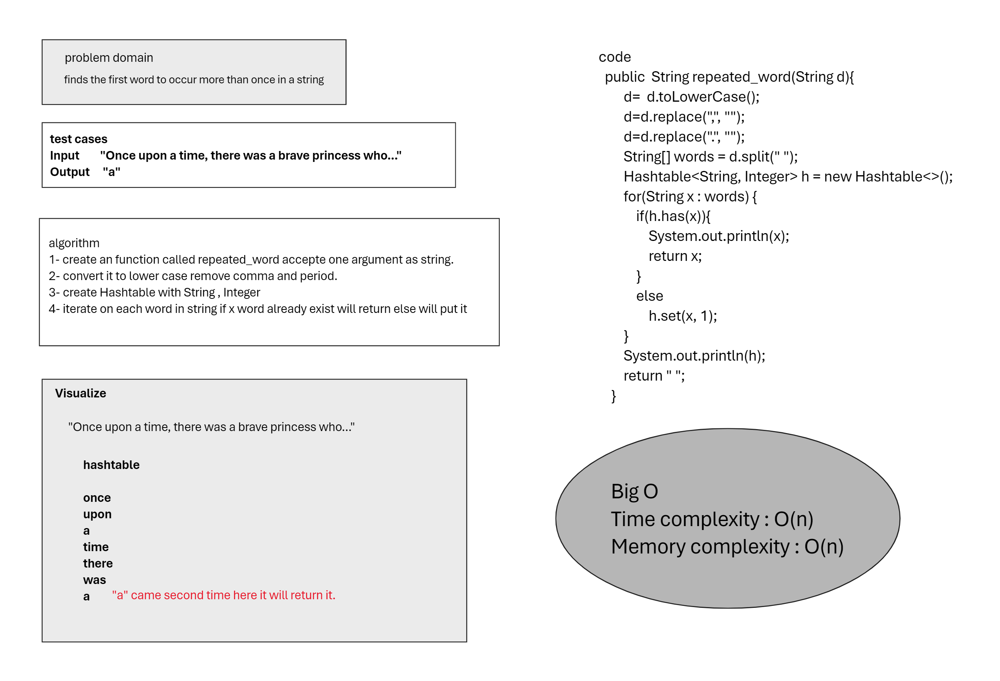

# repeated_word
finds the first word to occur more than once in a string

## Whiteboard Process
<!-- Embedded whiteboard image -->

## Approach & Efficiency
Time complexity : O(n)  
Memory complexity : O(n)

## Solution
<!-- Show how to run your code, and examples of it in action -->
I put the code in the (Main class)
and I put a test in (Repeated_word_lab31.java)
`Repeated_word_lab31`

