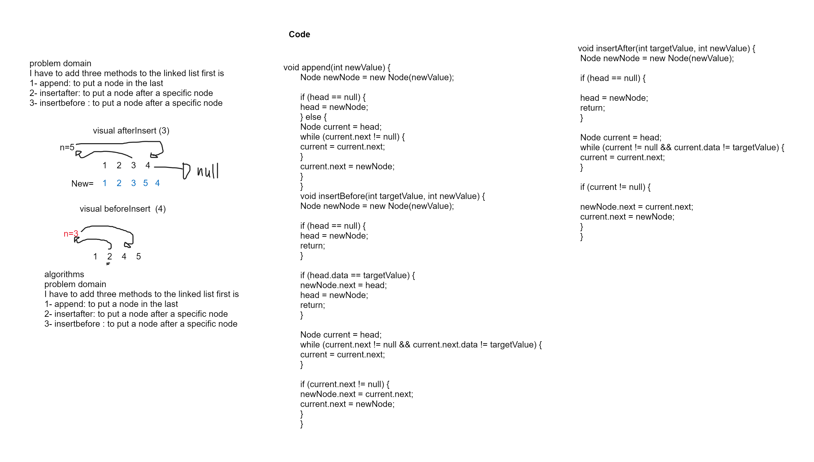

## Challenge

This challenge is to implement more methods on the linked list data structure which is `insert After , insert berfore , append`.

## WhiteBoard



## Approach & Efficiency

- **Append method**: Check if the linked list is empty, if so, make the new node the head of the list Otherwise, traverse the linked list to the end Set the next pointer of the last node to the new node.
- **insert before method**:Traverse the linked list until a node with the value specified is found If the value is not found, throw an exception Otherwise, create a new node with the given new value Set the next pointer of the new node to the node with the value specified Set the next pointer of the previous node to the new node.
- **insert after method**: Traverse the linked list until a node with the value specified is found If the value is not found, throw an exception Otherwise, create a new node with the given new value Set the next pointer of the new node to the next node of the node with the value specified Set the next pointer of the node with the value specified to the new node

## Big o
1. **append method**: Time Complexity: O(n)
2. **insert before method**: Time Complexity: O(n)
3. **insert after method**: Time Complexity: O(n)


## Solution

### Code
```java
 void append(int newValue) {
        Node newNode = new Node(newValue);

        if (head == null) {
        head = newNode;
        } else {
        Node current = head;
        while (current.next != null) {
        current = current.next;
        }
        current.next = newNode;
        }
        }
        void insertBefore(int targetValue, int newValue) {
        Node newNode = new Node(newValue);

        if (head == null) {
        head = newNode;
        return;
        }

        if (head.data == targetValue) {
        newNode.next = head;
        head = newNode;
        return;
        }

        Node current = head;
        while (current.next != null && current.next.data != targetValue) {
        current = current.next;
        }

        if (current.next != null) {
        newNode.next = current.next;
        current.next = newNode;
        }
        }
        void insertAfter(int targetValue, int newValue) {
        Node newNode = new Node(newValue);

        if (head == null) {

        head = newNode;
        return;
        }

        Node current = head;
        while (current != null && current.data != targetValue) {
        current = current.next;
        }

        if (current != null) {

        newNode.next = current.next;
        current.next = newNode;
        }
        }
```