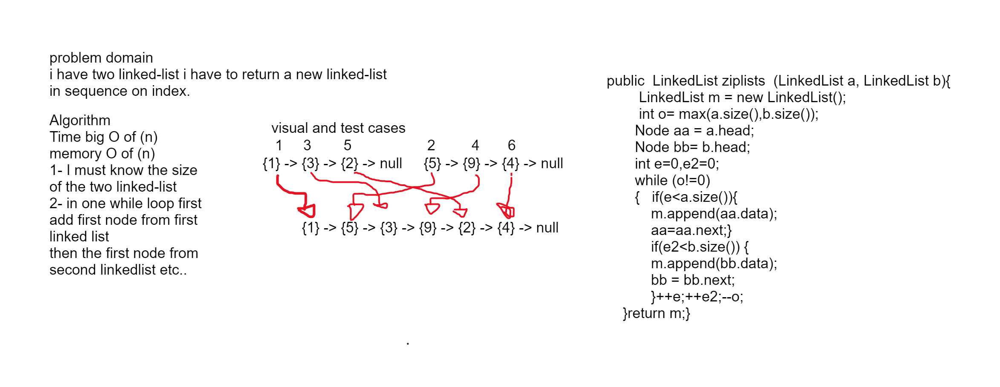

# Challenge Title
<!-- Description of the challenge -->
problem domain  
i have two linked-list i have to return a new linked-list
in sequence on index one frome each one.

## Whiteboard Process
<!-- Embedded whiteboard image -->

## Approach & Efficiency
<!-- What approach did you take? Why? What is the Big O space/time for this approach? -->
Time big O of (n)  
memory O of (n)   
algorithm  
1- I must know the size of the two linked-list  
2- in one while loop first add first node from first linked list 
then the first node from second linkedlist etc..


## Solution

<!-- Show how to run your code, and examples of it in action -->
<pre> @Test void FirstOne (){
        LinkedList l1 = new LinkedList();
        LinkedList l2 = new LinkedList();
        l1.append(1);
        l1.append(3);
        l1.append(2);
        l2.append(5);
        l2.append(9);
        l2.append(4);
        LinkedList F =  l1.ziplists(l1,l2);
        assertEquals(F.toString(),"{ 1 } -> { 5 } -> { 3 } -> { 9 } -> { 2 } -> { 4 } -> NULL");
    }
    @Test void SecondOne (){
        LinkedList l1 = new LinkedList();
        LinkedList l2 = new LinkedList();
        l1.append(1);
        l1.append(3);
        l2.append(2);
        l2.append(5);
        l2.append(9);
        LinkedList F =  l1.ziplists(l1,l2);
        assertEquals(F.toString(),"{ 1 } -> { 2 } -> { 3 } -> { 5 } -> { 9 } -> NULL");


    }</pre>
```java
 public  LinkedList ziplists  (LinkedList a, LinkedList b){
        LinkedList m = new LinkedList();
        int o= max(a.size(),b.size());
       Node aa = a.head;
       Node bb= b.head;
       int e=0,e2=0;
       while (o!=0)
       {   if(e<a.size()){
           m.append(aa.data);
           aa=aa.next;}
           if(e2<b.size()) {
           m.append(bb.data);
           bb = bb.next;
           }
++e;++e2;--o;
       }
        return m;}
```