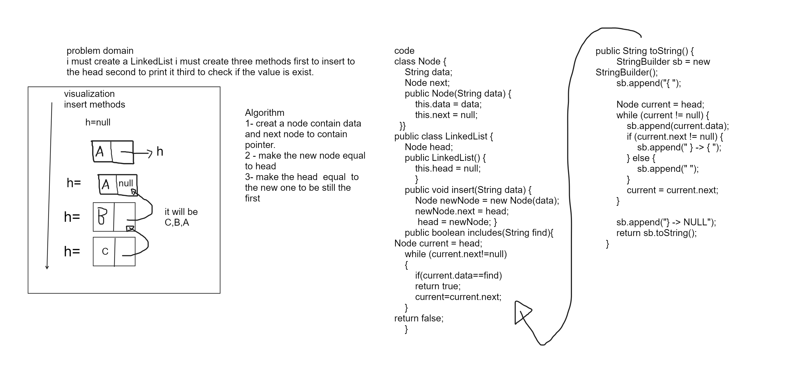

# Challenge Title
Linked List Implementation 

## Whiteboard Process

## Approach & Efficiency
time complexity
O(1) for insert method
O(n) for include method
O(n) for tostring method
Memory complexity.
O(1) for insert method

## Solution
<pre>
class Node {
    String data;
    Node next;

    public Node(String data) {
        this.data = data;
        this.next = null;
    }
}

public class LinkedList {
    Node head;

    public LinkedList() {
        this.head = null;
       
    }

    public void insert(String data) {
        Node newNode = new Node(data);
        newNode.next = head; 
         head = newNode; 
    }
    public boolean includes(String find){
Node current = head; 
    while (current.next!=null)
    {
        if(current.data==find)
        return true;
        current=current.next;
    }
return false;
    }
    public String toString() {
        StringBuilder sb = new StringBuilder();
        sb.append("{ ");
        
        Node current = head;
        while (current != null) {
            sb.append(current.data);
            if (current.next != null) {
                sb.append(" } -> { ");
            } else {
                sb.append(" ");
            }
            current = current.next;
        }
        
        sb.append("} -> NULL");
        return sb.toString();
    }
 
};
</pre>
