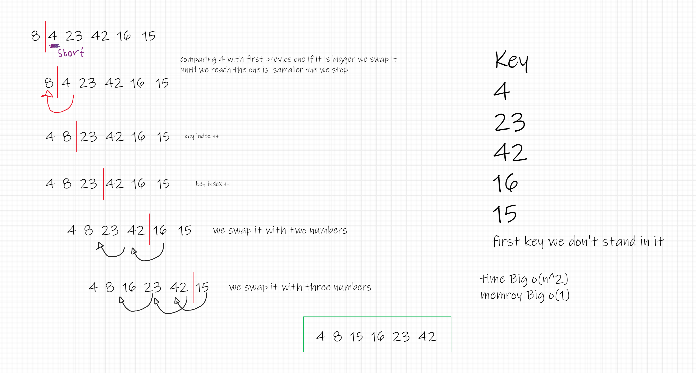

# insertion sort

#### Insertion sort is a simple and efficient sorting algorithm that builds the final sorted array one item at a time. It works by dividing the input array into two subarrays: one that is sorted and the other that is unsorted. The algorithm repeatedly takes the next unsorted element and places it in its correct position within the sorted subarray.

--- 
code 
```
  public static void sort(int arr[])
    {
        int n = arr.length;
        for (int i = 1; i < n; ++i) {
            int key = arr[i];
            int j = i - 1;
 
          System.out.println(j+" "+key);
            while (j >= 0 && arr[j] > key) {
                arr[j + 1] = arr[j];
                j = j - 1;
            }
            arr[j + 1] = key;
        }
    }
```
---

## Trace

- Start with the second element (index 1) as the first element is already considered sorted.
- Compare the second element with the first element. If the second element is smaller, swap them so that the smaller element comes first.
- Move to the third element and compare it with the second element, then the first element, and so on, moving left within the sorted subarray. Continue swapping elements as needed to place the third element in its correct position within the sorted subarray.
- Repeat this process for each unsorted element in the array, inserting it into its proper position within the sorted subarray.
- Continue this process until all elements in the array are in their correct positions. The entire array is now sorted. 

<pre>
Sample Array: [8,4,23,42,16,15] </pre>
link :- https://wbd.ms/share/v2/aHR0cHM6Ly93aGl0ZWJvYXJkLm1pY3Jvc29mdC5jb20vYXBpL3YxLjAvd2hpdGVib2FyZHMvcmVkZWVtL2ZjMWZhYmU1MmZkNTQ1YzJhOWZhMTM1YmM4YTQyYjU5X0JCQTcxNzYyLTEyRTAtNDJFMS1CMzI0LTVCMTMxRjQyNEUzRF9mODZkMmI5ZC0wZmUwLTQ4M2UtOGFmNy00NmI4YTY2MDViNTE=

---
Time Complexity : Big O(n^2)  
Memory Complexity : Big O(1)