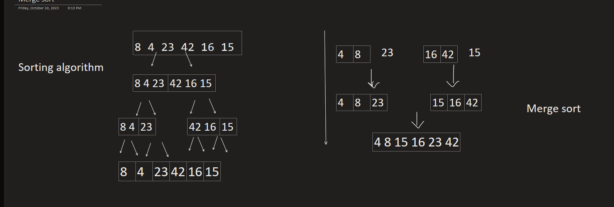

# Merge Sort
Merge Sort is a popular divide-and-conquer algorithm used to sort an array
Merge sort is containing two functions first one is the “sort”
It’s a recursion function it take 3 parameters left, right, array we use it t split the array into 2 pieces and split the splitted one into 2 pieces until we reach two numbers or one like the photo.
The second function is to merge the numbers in a sorted array.
It takes (left, right, middle, array) parameters from the sort function and edits the original array.
The merge function is to reorder the numbers-by-Number order, and we get bigger sorted subarrays. This merging process is continued until the sorted array is built from the smaller subarrays.
like the photo.
---
code
```
 public static  void merge(int arr[], int l, int m, int r)
    {
        int n1 = m - l + 1;
        int n2 = r - m;
 System.out.println(l+" "+r);
        int L[] = new int[n1];
        int R[] = new int[n2];
 
        for (int i = 0; i < n1; ++i)
            L[i] = arr[l + i];
        for (int j = 0; j < n2; ++j)
            R[j] = arr[m + 1 + j];
 
 
        int i = 0, j = 0;
 
        int k = l;
        while (i < n1 && j < n2) {
            if (L[i] <= R[j]) {
                arr[k] = L[i];
                i++;
            }
            else {
                arr[k] = R[j];
                j++;
            }
            k++;
        }
        while (i < n1) {
            arr[k] = L[i];
            i++;
            k++;
        }
        while (j < n2) {
            arr[k] = R[j];
            j++;
            k++;
        }
    }
 
  public static void  sort(int arr[], int l, int r)
    {
        if (l < r) {
            int m = l + (r - l) / 2;
            sort(arr, l, m);
            sort(arr, m + 1, r);
 
            merge(arr, l, m, r);
        }
    }
```
---

# trace 
<pre>
array [8,4,23,42,16,15]  </pre>  


|   L   |   R   |
| ----- | ----- |
|   0   |   1   |
|   0   |   2   |
|   3   |   4   |
|   3   |   5   |
|   0   |   5   |


<b> merge Function:</b>
This function is responsible for merging two sorted subarrays into a single sorted subarray.
It takes four arguments:
arr: The original array to be sorted.
l: The left index representing the start of the first subarray.
m: The middle index representing the end of the first subarray and the start of the second subarray.
r: The right index representing the end of the second subarray.
It first calculates the sizes of the two subarrays (n1 and n2) and creates two temporary arrays, L and R, to store the elements of these subarrays.
Then, it copies the elements from the original array into these temporary arrays.
The function uses three pointers, i, j, and k, to compare and merge elements from the two subarrays into the original array.
It iterates through both subarrays, comparing elements and placing the smaller element in the original array.
After one of the subarrays is exhausted, it copies the remaining elements from the other subarray.
The merged array is now sorted between indices l and r.

<b>sort Function:</b>
This is the main sorting function that implements the Merge Sort algorithm.
It takes three arguments:
arr: The array to be sorted.
l: The left index of the current subarray.
r: The right index of the current subarray.
It is a recursive function that continues dividing the array into smaller subarrays until the subarrays are of size 1 (base case).
At each recursive step, it calculates the middle index m and recursively sorts the left and right halves of the current subarray.
Finally, it calls the merge function to merge the two sorted halves back into a single sorted subarray.
The merge and sort functions work together to sort the entire input array using the Merge Sort algorithm. This sorting algorithm has a time complexity of O(n*log(n)), making it efficient for large datasets