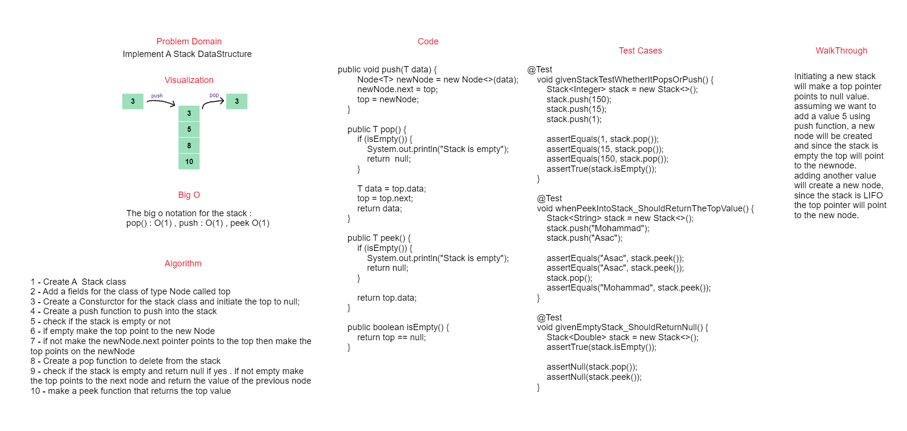
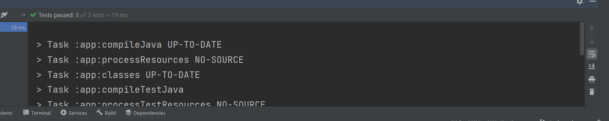

## Stack

### WhiteBoard

### Summary

A **stack** is a linear data structure that follows the Last-In-First-Out (LIFO) principle. In a stack, elements are added and removed from the same end, which is typically referred to as the "top" of the stack. The most recently added item is the first one to be removed. Common operations for a stack include:

- **Push**: Adding an element to the top of the stack.
- **Pop**: Removing and returning the element at the top of the stack.
- **Peek**: Viewing the element at the top of the stack without removing it.
- **isEmpty**: Checking if the stack is empty.

#### Approach & Efficiency

push(value):

1. Create a new Node with the specified value.
    - Set the next pointer of the new Node to the current top of the stack.
    - Set the top of the stack to the new Node.
2. pop():

    - Check if the stack is empty. If it is, raise an exception.
    - Get the value of the Node at the top of the stack.
    - Set the top of the stack to the next Node.
    - Return the value of the Node.
3. peek():

    - Check if the stack is empty. If it is, raise an exception.
    - Return the value of the Node at the top of the stack.
    - is_empty():
    - Check if the top of the stack is None. If it is, return True. Otherwise, return False.
#### Big o
The big o notation for the stack :
pop() : O(1) , push : O(1) , peek O(1)
### Solution

