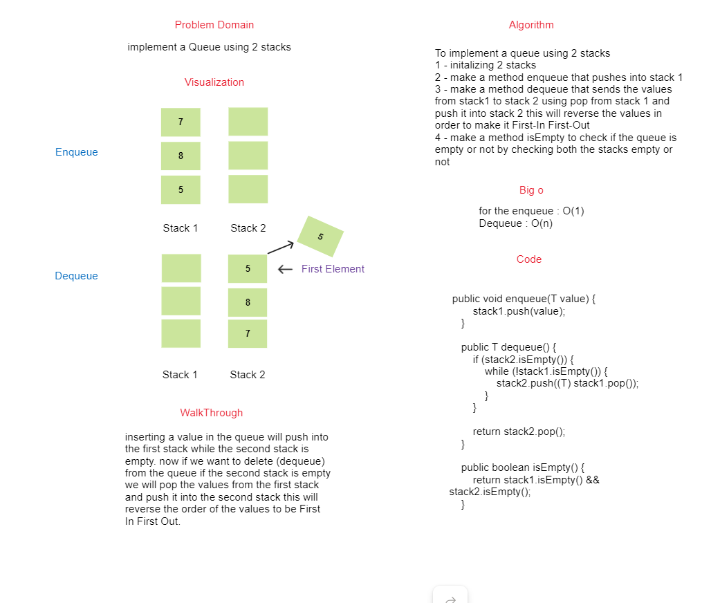
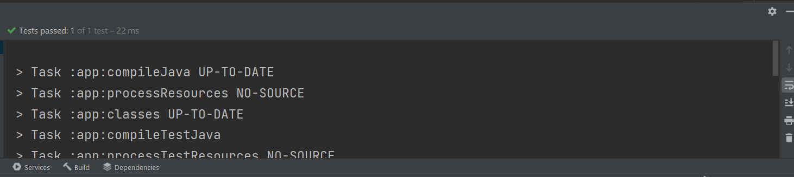

## Pseduo Queue
<!-- Description of the challenge -->
### Description
to make a queue using two stacks we need to make the first stack as a enqueue method and the second stack as a dequeue method

by making  this we will accomplish the FIFO that queue uses. 

### WhiteBoard

### Approach & Efficiency

The approach used in this to make The first stack acts like the enqueue method and push inside it
and making the second stack act like the dequeue method.

on dequeue the values from the first stack will be popped and pushed inside the second stack
this will allow us to make the FIFO principle for the queue.

### Big O

For the enqueue O(1) , Dequeue O(n).

## Solution

