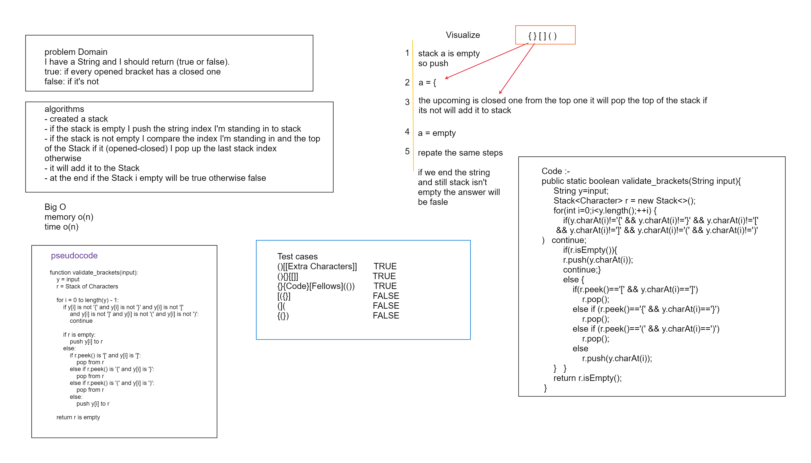
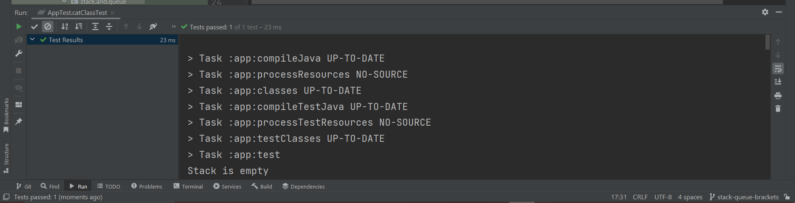

# stack-queue-brackets
## problem Domain
i have a String and I should return true or false 
true if every opened bracket has closed one
false if it's not

<!-- Description of the challenge -->

## Whiteboard Process

## Approach & Efficiency
<!-- What approach did you take? Why? What is the Big O space/time for this approach? -->
algorithms
- created a stack
- if the stack is empty I push the string index I'm standing in to stack
- if the stack is not empty I compare the index I'm standing in and the top 
of the Stack if it (opened-closed) I pop up the last stack index
otherwise 
- it will add it to the Stack
- at the end if the Stack i empty will be true otherwise false  

#### Big o
The big time o(n)
The big memory o(n)

## Solution
<!-- Show how to run your code, and examples of it in action -->
